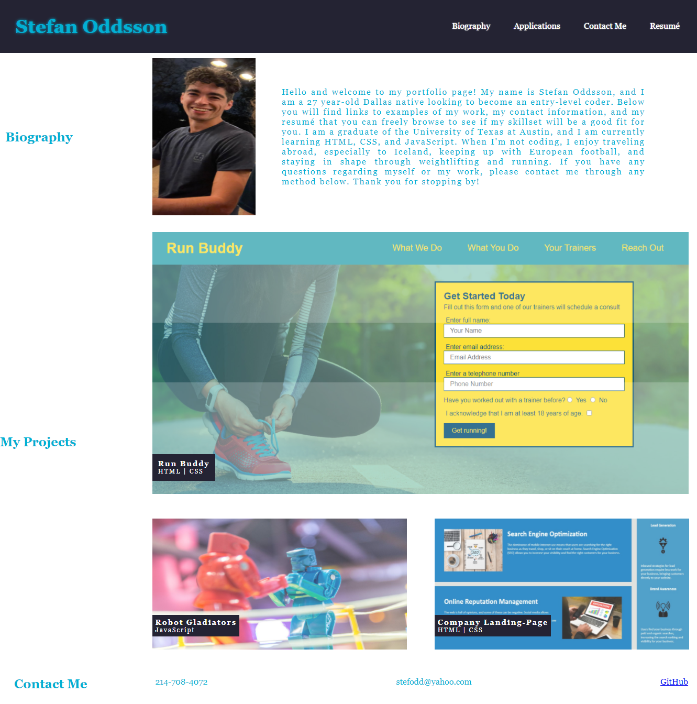

# Portfolio Project

## Description

The goal of this project was to create a portfolio webpage using HTML and CSS. The page includes navigation bar with clickable tabs that re-direct to their corresponding sections.

A photo along with a bio is included as well as a section to showcase other projects I have done. Clicking on the images takes you to the deployed project. Finally there is a contact section that includes my phone number, email address, and GitHub Link.

The page also contains media queries that changes the layout depending on three different screen widths, 980px, 768px, and 575px.

Here is a screenshot of the webpage in its default state 
.

Here you will find a link to the deployed website on GitHub 
